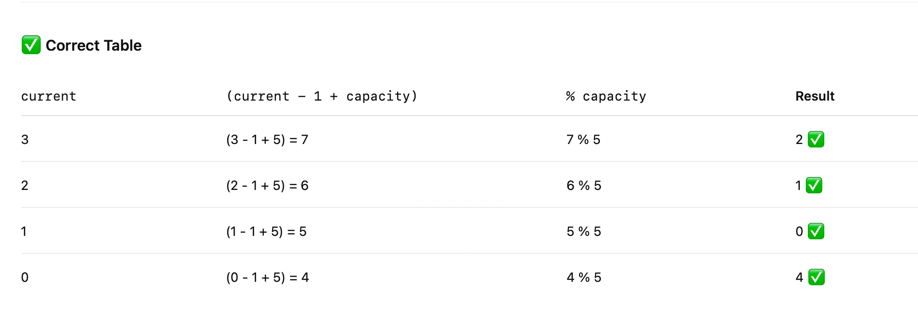

## Daily Coding Problem

**Good morning! Here's your coding interview problem for today.**

This problem was asked by Twitter.

You run an e-commerce website and want to record the last N order ids in a log. Implement a data structure to accomplish this, with the following API:

- record(order_id): adds the order_id to the log
    
`I want to control the size of my list. Since atrrays have limited space, a String[] is not a good solution.`

- get_last(i): gets the ith last element from the log. i is guaranteed to be smaller than or equal to N.
    
`Last in this case is the most recent order added, not the last position. So I need to have a 'current' pointer control`

You should be as efficient with time and space as possible.

-----------

```
When thinking about checking the last added number in a array and current is on the next position, a good logic is:

int lastAddedIndex = (current -1 + capacity) % capacity


```


```
javac OrderRecordLogger.java && java OrderRecordLogger
```