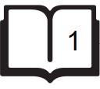
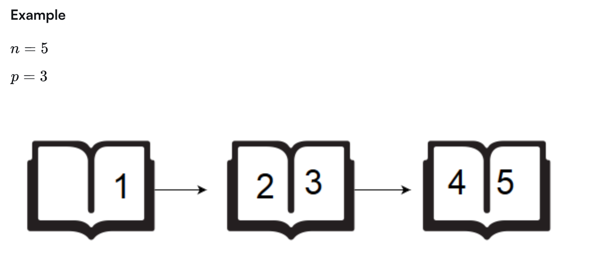
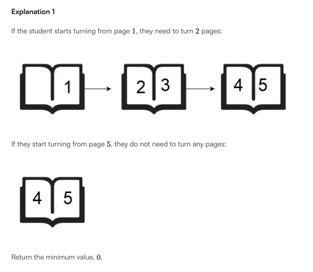

## Drawing Book
[link](https://www.hackerrank.com/challenges/drawing-book/problem?utm_campaign=challenge-recommendation&utm_medium=email&utm_source=24-hour-campaign)

A teacher asks the class to open their books to a page number. A student can either start turning pages from the front of the book or from the back of the book. They always turn pages one at a time. When they open the book, page  is always on the right side:

When they flip page , they see pages  and . Each page except the last page will always be printed on both sides. The last page may only be printed on the front, given the length of the book. If the book is  pages long, and a student wants to turn to page , what is the minimum number of pages to turn? They can start at the beginning or the end of the book.

Given n and p, find and print the minimum number of pages that must be turned in order to arrive at page .

Using the diagram above, if the student wants to get to page , they open the book to page , flip  page and they are on the correct page. If they open the book to the last page, page , they turn  page and are at the correct page. Return .

**Function Description**

Complete the pageCount function in the editor below.

pageCount has the following parameter(s):

int n: the number of pages in the book
int p: the page number to turn to

**Returns**

int: the minimum number of pages to turn

**Input Format**

The first line contains an integer , the number of pages in the book.
The second line contains an integer, , the page to turn to.

**Constraints**

Sample Input 0

6
2

Sample Output 0

1

Sample Input 1

5
4

Sample Output 1

0

